# Application Flowchart

## Complete User Journey

```mermaid
graph TD
    A[User Opens Browser] --> B[Navigate to localhost:3000]
    B --> C[React App Loads]
    C --> D[PDFUploader Component Renders]
    
    D --> E{User Action?}
    
    E -->|Upload PDF| F[handleFileSelection]
    F --> G{Valid PDF?}
    G -->|No| H[Show Error: Invalid file type]
    G -->|Yes| I{Size < 10MB?}
    I -->|No| J[Show Error: File too large]
    I -->|Yes| K[Set file state]
    
    K --> L[Show File Details]
    L --> M[Show Options Section]
    
    M --> N{User Selects Format}
    N -->|Excel| O[Show Sheet Selection]
    N -->|JSON| P[Hide Sheet Selection]
    N -->|Text| Q[Hide Sheet Selection]
    
    O --> R[User Selects Sheets]
    R --> S[Enable Extract Button]
    P --> S
    Q --> S
    
    S --> T[User Clicks Extract]
    T --> U[handleUpload Function]
    
    U --> V[Create FormData]
    V --> W[Append PDF file]
    W --> X[Append password if provided]
    X --> Y[Append outputFormat]
    Y --> Z{Format is Excel?}
    Z -->|Yes| AA[Append selected sheets]
    Z -->|No| AB[Skip sheets]
    
    AA --> AC[Send POST to /api/extract-cas]
    AB --> AC
    
    AC --> AD[Backend Receives Request]
    AD --> AE[Multer Saves PDF to uploads/]
    AE --> AF[Extract Request Parameters]
    
    AF --> AG[Call pdfExtractor.js]
    AG --> AH{Password Protected?}
    AH -->|Yes| AI[Use password to decrypt]
    AH -->|No| AJ[Extract directly]
    
    AI --> AK[Extract Text Content]
    AJ --> AK
    
    AK --> AL{Text Length > 100?}
    AL -->|No| AM[Error: PDF empty or corrupted]
    AL -->|Yes| AN[Call portfolioExtractor.js]
    
    AN --> AO[Find Portfolio Summary Section]
    AO --> AP[Parse Fund Names and Values]
    AP --> AQ{Portfolio Data Found?}
    AQ -->|No| AR[Error: No portfolio data]
    AQ -->|Yes| AS[Return portfolioData]
    
    AS --> AT[Call transactionExtractor.js]
    AT --> AU[For Each Fund]
    AU --> AV[Find Fund Section in Text]
    AV --> AW[Extract Folios]
    AW --> AX[Extract Transactions]
    AX --> AY[Calculate Balances]
    AY --> AZ{Transaction Data Found?}
    AZ -->|No| BA[Error: No transactions]
    AZ -->|Yes| BB[Return transactionData]
    
    BB --> BC{Output Format?}
    
    BC -->|Excel| BD[Call excelGenerator.js]
    BD --> BE{Portfolio Sheet Selected?}
    BE -->|Yes| BF[Generate Portfolio Sheet]
    BE -->|No| BG[Skip Portfolio Sheet]
    
    BF --> BH{Transactions Sheet Selected?}
    BG --> BH
    BH -->|Yes| BI[Generate Transactions Sheet]
    BH -->|No| BJ[Skip Transactions Sheet]
    
    BI --> BK{Holdings Sheet Selected?}
    BJ --> BK
    BK -->|Yes| BL[Generate Holdings Sheet]
    BK -->|No| BM[Skip Holdings Sheet]
    
    BL --> BN[Save Excel File]
    BM --> BN
    BN --> BO[Set Content-Type: xlsx]
    
    BC -->|JSON| BP[Create JSON Object]
    BP --> BQ[Add Metadata]
    BQ --> BR[Add Portfolio Data]
    BR --> BS[Add Transaction Data]
    BS --> BT[Add Raw Text]
    BT --> BU[Write JSON File]
    BU --> BV[Set Content-Type: json]
    
    BC -->|Text| BW[Write Text Content to File]
    BW --> BX[Set Content-Type: text/plain]
    
    BO --> BY[Set Content-Disposition Header]
    BV --> BY
    BX --> BY
    
    BY --> BZ[Send File via res.download]
    BZ --> CA[Frontend Receives Blob]
    
    CA --> CB[Create Blob with MIME Type]
    CB --> CC[Create Object URL]
    CC --> CD[Create Download Link]
    CD --> CE[Trigger Click]
    CE --> CF[File Downloads to User]
    
    CF --> CG[Show Success Message]
    CG --> CH[Cleanup: Delete Uploaded PDF]
    CH --> CI[Schedule: Delete Output File in 5 min]
    
    CI --> CJ[User Can Upload Another File]
    CJ --> E
    
    AM --> CK[Send Error Response]
    AR --> CK
    BA --> CK
    CK --> CL[Frontend Shows Error]
    CL --> CM[User Can Retry]
    CM --> E
```



## Simplified Flow

```
┌─────────────────────────────────────────────────────────────┐
│                    1. USER INTERACTION                      │
│                                                             │
│  Upload PDF → Enter Password → Select Format → Select       │
│  Sheets → Click Extract                                     │
└─────────────────────┬───────────────────────────────────────┘
                      │
                      ▼
┌─────────────────────────────────────────────────────────────┐
│                    2. FRONTEND PROCESSING                   │
│                                                             │
│  Validate File → Create FormData → Send API Request →       │
│  Show Progress                                              │
└─────────────────────┬───────────────────────────────────────┘
                      │
                      ▼
┌─────────────────────────────────────────────────────────────┐
│                    3. BACKEND RECEIVES                      │
│                                                             │
│  Multer Saves PDF → Extract Parameters → Start Processing   │
└─────────────────────┬───────────────────────────────────────┘
                      │
                      ▼
┌─────────────────────────────────────────────────────────────┐
│                    4. PDF EXTRACTION                        │
│                                                             │
│  pdfExtractor.js → Extract Text from PDF (with password)    │
└─────────────────────┬───────────────────────────────────────┘
                      │
                      ▼
┌─────────────────────────────────────────────────────────────┐
│                    5. DATA PARSING                          │
│                                                             │
│  portfolioExtractor.js → Parse Portfolio Summary            │
│  transactionExtractor.js → Parse Transactions & Holdings    │
└─────────────────────┬───────────────────────────────────────┘
                      │
                      ▼
┌─────────────────────────────────────────────────────────────┐
│                    6. OUTPUT GENERATION                     │
│                                                             │
│  IF Excel: excelGenerator.js → Generate Selected Sheets     │
│  IF JSON: Create JSON with all data                         │
│  IF Text: Write raw text to file                            │
└─────────────────────┬───────────────────────────────────────┘
                      │
                      ▼
┌─────────────────────────────────────────────────────────────┐
│                    7. FILE DELIVERY                         │
│                                                             │
│  Set Headers → Send File → Frontend Downloads → Show        │
│  Success                                                    │
└─────────────────────┬───────────────────────────────────────┘
                      │
                      ▼
┌─────────────────────────────────────────────────────────────┐
│                    8. CLEANUP                               │
│                                                             │
│  Delete Uploaded PDF → Schedule Output File Deletion        │
└─────────────────────────────────────────────────────────────┘
```

## Component Interaction

```
┌──────────────────────────────────────────────────────────────┐
│                         Browser                              │
│  ┌────────────────────────────────────────────────────────┐  │
│  │                      App.js                            │  │
│  │  ┌──────────────────────────────────────────────────┐  │  │
│  │  │              PDFUploader.js                      │  │  │
│  │  │  ┌────────────────────────────────────────────┐  │  │  │
│  │  │  │          ProgressBar.js                    │  │  │  │
│  │  │  └────────────────────────────────────────────┘  │  │  │
│  │  │                                                  │  │  │
│  │  │  State:                                          │  │  │
│  │  │  - file                                          │  │  │
│  │  │  - password                                      │  │  │
│  │  │  - outputFormat                                  │  │  │
│  │  │  - selectedSheets                                │  │  │  
│  │  │  - loading, progress, error                      │  │  │ 
│  │  │                                                  │  │  │
│  │  │  Functions:                                      │  │  │
│  │  │  - handleFileSelection()                         │  │  │
│  │  │  - handleUpload()                                │  │  │
│  │  │  - handleSheetToggle()                           │  │  │
│  │  └──────────────────────────────────────────────────┘  │  │
│  └────────────────────────────────────────────────────────┘  │
└──────────────────────────────────────────────────────────────┘
                            │
                            │ axios.post()
                            ▼
┌──────────────────────────────────────────────────────────────┐
│                    Express Server                            │
│  ┌────────────────────────────────────────────────────────┐  │
│  │                    server.js                           │  │
│  │  - CORS middleware                                     │  │
│  │  - Body parser                                         │  │
│  │  - Routes registration                                 │  │
│  └────────────────────────────────────────────────────────┘  │
│                            │                                 │
│                            ▼                                 │
│  ┌────────────────────────────────────────────────────────┐  │
│  │              routes/casRoutes.js                       │  │
│  │  - POST /api/extract-cas                               │  │
│  │  - GET /api/status                                     │  │
│  └────────────────────────────────────────────────────────┘  │
│                            │                                 │
│                            ▼                                 │
│  ┌────────────────────────────────────────────────────────┐  │
│  │           middleware/upload.js (Multer)                │  │
│  │  - Handle file upload                                  │  │
│  │  - Save to uploads/                                    │  │
│  └────────────────────────────────────────────────────────┘  │
│                            │                                 │
│                            ▼                                 │
│  ┌────────────────────────────────────────────────────────┐  │
│  │              extractors/pdfExtractor.js                │  │
│  │  - extractTextFromPDF()                                │  │
│  │  - Uses pdf-parse library                              │  │
│  └────────────────────────────────────────────────────────┘  │
│                            │                                 │
│                            ▼                                 │
│  ┌────────────────────────────────────────────────────────┐  │
│  │          extractors/portfolioExtractor.js              │  │
│  │  - extractPortfolioSummary()                           │  │
│  │  - Parse fund names and values                         │  │ 
│  └────────────────────────────────────────────────────────┘  │ 
│                            │                                 │
│                            ▼                                 │
│  ┌────────────────────────────────────────────────────────┐  │
│  │         extractors/transactionExtractor.js             │  │
│  │  - extractFundTransactions()                           │  │
│  │  - Parse folios and transactions                       │  │
│  └────────────────────────────────────────────────────────┘  │
│                            │                                 │
│                            ▼                                 │
│  ┌────────────────────────────────────────────────────────┐  │
│  │           extractors/excelGenerator.js                 │  │ 
│  │  - generateExcelReport()                               │  │
│  │  - generatePortfolioSummarySheet()                     │  │
│  │  - generateTransactionsSheet()                         │  │ 
│  │  - generateMFHoldingsSheet()                           │  │
│  │  - Uses exceljs library                                │  │
│  └────────────────────────────────────────────────────────┘  │
└──────────────────────────────────────────────────────────────┘
```

## Error Handling Flow

```
┌─────────────────────────────────────────────────────────────┐
│                      Error Occurs                           │
└─────────────────────┬───────────────────────────────────────┘
                      │
                      ▼
              ┌───────────────┐
              │  Error Type?  │
              └───────┬───────┘
                      │
        ┌─────────────┼─────────────┐
        │             │             │
        ▼             ▼             ▼
┌──────────────┐ ┌──────────┐ ┌──────────────┐
│ File Invalid │ │ PDF Error│ │ Parse Error  │
└──────┬───────┘ └────┬─────┘ └──────┬───────┘
       │              │              │
       └──────────────┼──────────────┘
                      │
                      ▼
              ┌───────────────┐
              │ Log to Console│
              └───────┬───────┘
                      │
                      ▼
              ┌───────────────┐
              │ Cleanup Files │
              └───────┬───────┘
                      │
                      ▼
              ┌───────────────┐
              │ Send Error    │
              │ Response      │
              └───────┬───────┘
                      │
                      ▼
              ┌───────────────┐
              │ Frontend      │
              │ Displays Error│
              └───────┬───────┘
                      │
                      ▼
              ┌───────────────┐
              │ User Can Retry│
              └───────────────┘
```

## State Transitions

```
┌─────────────┐
│   Initial   │
│   State     │
└──────┬──────┘
       │
       ▼
┌─────────────┐
│ File        │
│ Selected    │
└──────┬──────┘
       │
       ▼
┌─────────────┐
│ Options     │
│ Configured  │
└──────┬──────┘
       │
       ▼
┌─────────────┐
│ Uploading   │
│ (10%)       │
└──────┬──────┘
       │
       ▼
┌─────────────┐
│ Extracting  │
│ (30%)       │
└──────┬──────┘
       │
       ▼
┌─────────────┐
│ Parsing     │
│ (60%)       │
└──────┬──────┘
       │
       ▼
┌─────────────┐
│ Processing  │
│ (80%)       │
└──────┬──────┘
       │
       ▼
┌─────────────┐
│ Generating  │
│ (95%)       │
└──────┬──────┘
       │
       ▼
┌─────────────┐
│ Complete    │
│ (100%)      │
└──────┬──────┘
       │
       ▼
┌─────────────┐
│ Success     │
│ Message     │
└─────────────┘
```

---

**Note**: This flowchart represents the complete application flow from user interaction to file download. Each step includes error handling and vali